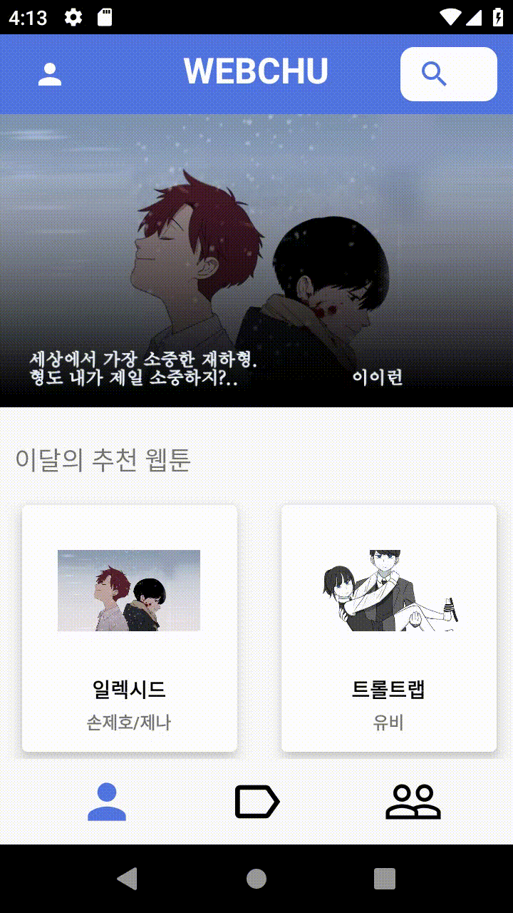
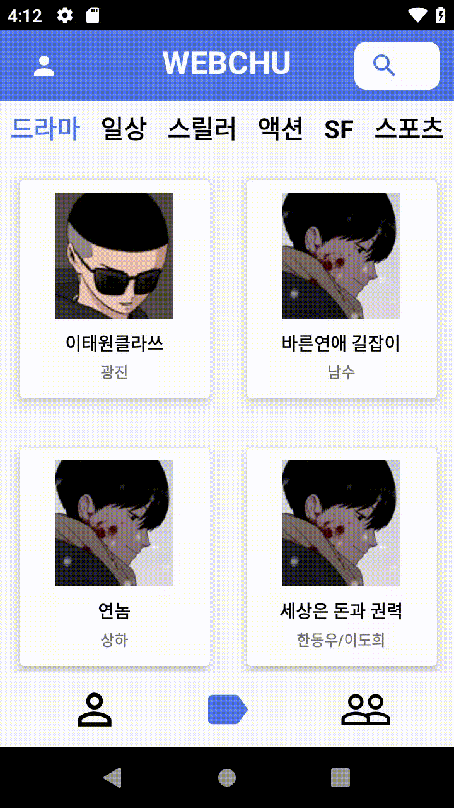

## 2018-2학기 JavaProject

#주제: Webtoon Platform

[영상링크](https://www.youtube.com/watch?v=0UcKyujs_Ts&t=2s)

* 검색창
  * EditText에 **슬라이드 애니메이션** 적용
{: width="150" height="300"}

* 웹툰 목록
  * **RecycleView**를 사용하여 **GridView** 형식으로 사용자에게 제공
  
{: width="150" height="300"}

*MyPage
  * 사용자의 선호 장르를 **원 그래프**로 시각화
  * **팔로우, 팔로잉** 파악 가능
  
{: width="150" height="300"}

* Webtoon 목록
  * 해당 Webtoon의 **회차정보**를 보여줌
  * **즐겨찾기** 기능--> Mypage에서 
  
{: width="150" height="300"}

