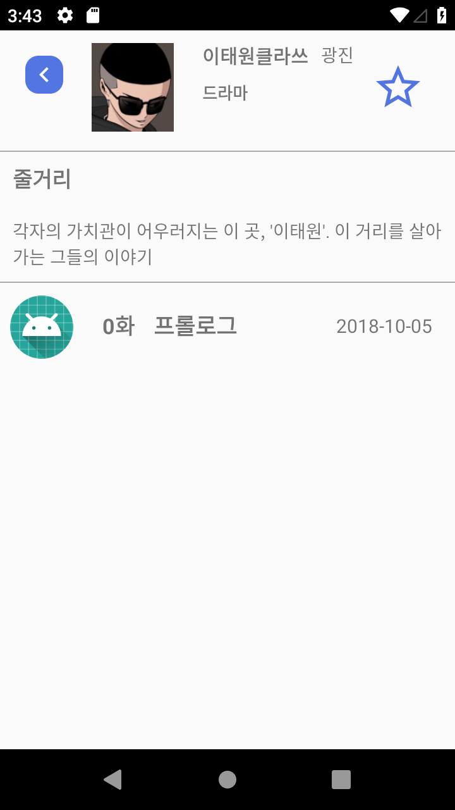

## 2018-2학기 JavaProject

# 주제: Webtoon Platform

[영상링크](https://www.youtube.com/watch?v=0UcKyujs_Ts&t=2s)

* 검색창

  * EditText에 **슬라이드 애니메이션** 적용

* 웹툰 목록

  *  **RecycleView**를 사용하여 **GridView** 형식으로 사용자에게 제공

* MyPage
  * 사용자의 선호 장르를 **원 그래프**로 시각화
  * **팔로우, 팔로잉** 파악 가능

* Webtoon 목록
  * 해당 Webtoon의 **회차정보**를 보여줌
  * **즐겨찾기** 기능--> Mypage에서 

